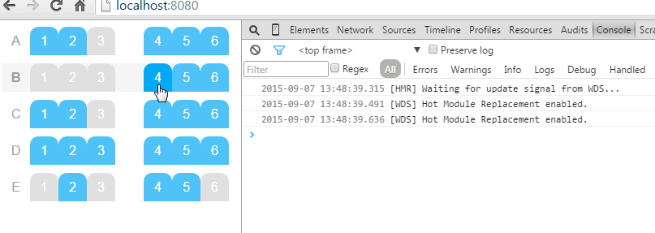

[](https://nodei.co/npm/react-seatmap/)
# react-seatmap
A React component to display a minimal, yet functional seatmap.



### Usage
Two versions are available. The default one can be installed via `npm install react-seatmap` and you will need to attach a stylesheet to see a decent seatmap. You can find a sample one in main.css.

```javascript
import React from 'react';
import Seatmap from 'react-seatmap';
React.render(
    <Seatmap rows={rows} maxReservableSeats={3} alpha />,
    document.getElementById('app')
);
```

There is a bundled version available in `dist`, where the css is bundled together with the component via webpack.

### props
#### `addSeatCallback: PropTypes.func(row, number)`
The callback executed when a seat is added
- `row`, the row number
- `seat`, the seat number

#### `alpha: PropTypes.bool`
`true` if your rows are enumerated using letters, `false` otherwise.

#### `maxReservableSeats: PropTypes.number`
The maximum number of seats that can be selected.

#### `removeSeatCallback: PropTypes.func(row, number)`
The callback executed when a seat is removed
- `row`, the row number
- `seat`, the seat number

#### `rows: PropTypes.arrayOf(RowType)`
The array containing the data to build the seatmap.
`RowType` is defined as `PropTypes.arrayOf(SeatType)`, and `SeatType` is
```
PropTypes.shape({
  number: PropTypes.string.isRequired,
  isReserved: PropTypes.bool
});
```
where
- `number` is the seat number;
- `isReserved` tells whether the seat is already reserved or not (you can leave this empty when the seat is free)

If there is no seat at that location (e.g., space next to an aisle seat), put `null`.

#### `seatWidth: PropTypes.number` (default: 35)
The seat width. Needs to be customized as the seatmap width are computed from this
number.
